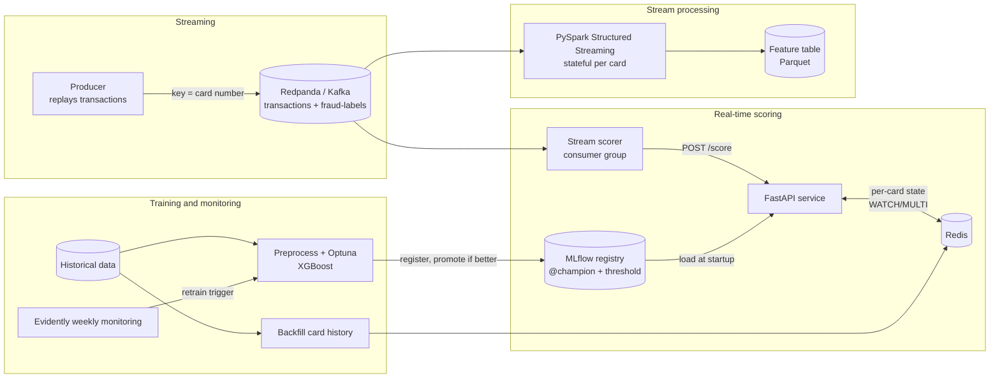

# 🛡️ Real-Time Fraud Detection — Streaming ML & MLOps Pipeline

**An end-to-end system that scores card transactions for fraud in real time: from a Kafka event stream, through leakage-safe per-card features, to a monitored, versioned model behind an API.**

[](https://github.com/Mazadul4x4/Fraud-Detection-Streaming/actions/workflows/ci.yml)
[](https://www.python.org/)
[](https://redpanda.com/)
[](https://spark.apache.org/)
[](https://mlflow.org/)
[](https://fastapi.tiangolo.com/)
[](docker-compose.yml)
[](LICENSE)

> 🎓 **Master's project**, M.Sc. Computer Science, *Data Science & Analytics*, **EPITA (Paris, France)**.
> Built in public, one pull request per phase; since Phase 10 every change is gated by CI.

---

## ⚡ TL;DR

- **What:** transactions stream through **Kafka (Redpanda)**; per-card behavioural features are computed with **one tested definition** shared by training (pandas), the **FastAPI** service (state in **Redis**) and **PySpark Structured Streaming**; an **XGBoost** model tuned with **Optuna** is versioned in **MLflow** (champion/challenger) and monitored for drift with **Evidently**.
- **Results on the held-out test set** (6 unseen months, never used for any decision): **PR-AUC 0.969**, **recall 98.6% at a 1% false-positive rate**, fraud-related cost cut by **97.9%** (from $1.13M to $24K) with the validation-chosen threshold.
- **Evidence over claims:** 43 unit tests + a Spark parity test in CI; online features verified **identical to training features on 5,000 real transactions**; an ablation shows real-time card history cuts false alarms **~5.6x**; load tests and drift experiments are reported honestly, including targets **not** met.

---

## 💼 What This Project Demonstrates

| Area | What I built | Skills |
|---|---|---|
| **Data science** | EDA, leakage-safe per-card features, imbalance study, cost-based thresholds | Statistics, feature engineering, evaluation under imbalance |
| **Machine learning** | XGBoost vs logistic regression vs baseline, Optuna search, ablation study | XGBoost, scikit-learn, imbalanced-learn, Optuna |
| **Data engineering** | Kafka producer/consumers keyed by card, stateful Spark streaming | Redpanda/Kafka, PySpark Structured Streaming, Parquet |
| **MLOps** | Model registry with champion/challenger, Redis online state, drift monitoring | MLflow, Redis, Evidently |
| **Software engineering** | Typed API, 40+ tests incl. training/serving parity, Docker, CI | FastAPI, Pydantic, pytest, ruff, Docker, GitHub Actions |
| **Product thinking** | Metrics tied to money and customer friction | Precision/recall trade-offs, business cost |

---

## 🎯 The Problem

Card fraud must be stopped in **milliseconds**, before a payment clears. Three things make it hard:

| Challenge | Why it matters | How this system responds |
|---|---|---|
| **Extreme imbalance** | 0.4-0.6% fraud: a model that never flags anything is "99.5% accurate" and useless | PR-AUC and recall at a fixed false-positive rate; class weighting; cost-based threshold |
| **Fraud comes in bursts** | EDA: all frauds on a compromised card happen within ~1 h to ~3 days | Real-time per-card features (last 1h / 24h activity) from the stream |
| **The world drifts** | Monthly fraud rate varies ~2.7x; seasonal volume shifts | Weekly drift + performance monitoring with a retrain trigger |

---

## 🏗️ Architecture



The card-history features have **one definition** (`CardHistoryStore`), used by the API, the Redis store and the Spark job, and **tested to equal** the pandas training features.

---

## 📊 Results

### Final evaluation on the held-out test set (Jun-Dec 2020)

Champion model and its validation-chosen threshold (0.23) applied **unchanged**; the script refuses to evaluate the same model version twice, to avoid tuning on the test set.

| Metric | Validation | **Test (held out)** |
|---|---|---|
| Transactions / fraud rate | 371,825 / 0.61% | **555,719 / 0.39%** |
| PR-AUC | 0.9827 | **0.9691** |
| PR-AUC lift over random | 160x | **251x** |
| ROC-AUC | 0.9998 | **0.9992** |
| Recall @ 1% FPR | 0.9948 | **0.9860** |
| Precision / recall @ 0.23 | 0.79 / 0.98 | **0.73 / 0.97** |
| False alarms (share of legitimate) | 0.163% | **0.139%** |
| Fraud-related cost: no model -> model | $1.22M -> $16K | **$1.13M -> $24K (-97.9%)** |

Lower test PR-AUC and precision come from the lower fraud rate (prior shift): lift over random rises and the false-alarm rate falls. Details: [`docs/final_results.md`](docs/final_results.md).

### Targets

| Metric | Target | Result |
|---|---|---|
| PR-AUC | >= 0.80 | **0.969** ✅ |
| ROC-AUC | >= 0.95 | **0.999** ✅ |
| Recall @ 1% FPR | >= 0.85 | **0.986** ✅ |
| p99 latency | < 50 ms | 120 ms single user; 1.3-1.5 s with 20 concurrent users ❌ (laptop) |
| Throughput | >= 500 req/s | 32 req/s (1 worker), 48 req/s (3 workers) ❌ (laptop) |
| Drift detection | < 24 h | First weekly window (<= 4 days) ⚠️ daily label-free checks would meet it |

### Key experiments (validation set)

| Experiment | Finding |
|---|---|
| Baselines | XGBoost PR-AUC 0.98 vs logistic regression 0.43 vs dummy 0.006; logistic regression has ROC-AUC 0.99 but 14% precision: **ROC-AUC misleads under imbalance** |
| Ablation | Removing real-time card-history features: precision 0.82 -> 0.44, **~5.6x more false alarms** at similar recall: the streaming architecture pays for itself |
| Imbalance handling | Weights, undersampling, SMOTE, SMOTE-Tomek within 0.006 PR-AUC: **threshold choice matters more than resampling** |
| Optuna tuning | +0.0006 PR-AUC over hand-picked parameters: the model is near the data's ceiling; gains need new features |
| Monitoring (real data) | 28 weeks, recall @ 1% FPR stays 0.95-1.0, no retrain. Data drift follows seasonal volume **without** model decay |
| Monitoring (simulated x1.8 amounts) | Flagged in the first week via prediction drift and a recall drop (0.99 -> 0.66-0.87); confirms the model learned absolute fraud amount ranges |
| Load test | One worker saturates at ~32 req/s (Little's law checks out); 3 workers +51% throughput; bottleneck: per-request pandas + shared 4-thread laptop |

---

## 🧠 Key Engineering Decisions

1. **Chronological splits, test set locked.** Train = 2019, validation = Jan-Jun 2020, test = Jun-Dec 2020. Every choice was made on validation; the test set was opened once.
2. **One feature definition everywhere.** Training (pandas), API, Redis store and Spark all compute card history with the same logic, enforced by parity tests: unit tests, a Spark test across micro-batches, and an end-to-end check on 5,000 real transactions.
3. **Leakage-safe history.** Every card feature uses only *earlier* transactions; a test proves adding future transactions never changes past features.
4. **Kafka keyed by card number.** Per-key ordering keeps each card's transactions in sequence, which history features require. Labels travel on a separate topic, like delayed chargebacks.
5. **Redis instead of Feast.** Feast (0.66) pins pandas < 3, and stored window aggregates go stale between events, which would break training/serving parity. The API reads each card's state, computes features at request time, and writes it back atomically (`WATCH/MULTI/EXEC`). Redis also makes multi-worker scaling correct and survives restarts.
6. **Champion/challenger registry.** A new model becomes `@champion` only if it beats the current one on validation PR-AUC; it carries its own threshold as a version tag. In practice this kept a weaker re-tuned model out of production.
7. **Metrics that survive imbalance and prior shift.** PR-AUC for model selection; recall @ 1% FPR as the retrain trigger, because PR-AUC also drops when fraud simply becomes rarer.
8. **Measure, then optimise.** MLflow's background job runner was found (122 processes) and disabled: 1.6 GB -> 0.4 GB. Load tests located the real bottleneck before any optimisation.

---

## 🗂️ Dataset

[Credit Card Transactions Fraud Detection Dataset](https://www.kaggle.com/datasets/kartik2112/fraud-detection) (Kaggle, CC0): ~1.85M simulated transactions, 983 cards, Jan 2019 - Dec 2020. Chosen over the PCA-anonymised `creditcard.csv` because it has **card IDs, timestamps and merchant categories**, required for real-time per-card features. Personal fields (name, address, gender, job) are **excluded** from the model. See [`data/README.md`](data/README.md).

---

## 🧰 Tech Stack

| Layer | Tool |
|---|---|
| Streaming | Redpanda (Kafka API), confluent-kafka |
| Stream processing | PySpark 4.2 Structured Streaming (`applyInPandasWithState`) |
| Online state | Redis |
| Modelling | XGBoost, scikit-learn, imbalanced-learn, Optuna |
| Tracking & registry | MLflow 3 (server in Docker) |
| Serving | FastAPI, Uvicorn, Pydantic |
| Monitoring | Evidently |
| Packaging & CI | Docker Compose, GitHub Actions, ruff, pytest, Locust |

---

## 📁 Repository Structure

```
.
├── .github/workflows/ci.yml     # lint + tests, Spark parity test, Docker builds
├── data/README.md               # how to download the data (data itself is git-ignored)
├── docs/                        # model card, final results, monitoring and load-test reports
├── notebooks/                   # 01_eda.ipynb, 02_model_experiments.ipynb
├── src/
│   ├── training/                # preprocess, evaluate, train, tune (Optuna+MLflow), final_evaluation
│   ├── api/                     # FastAPI app, schemas, CardHistoryStore
│   ├── ingestion/               # Kafka producer, stream scorer, event format
│   ├── streaming/               # PySpark stateful feature job
│   ├── feature_store/           # Redis card state, history backfill, parity check
│   └── monitoring/              # Evidently drift + performance report
├── tests/                       # unit, contract, parity tests; locustfile.py (load test)
├── Dockerfile, Dockerfile.spark, docker-compose.yml
├── requirements.txt, requirements-api.txt, requirements-spark.txt
└── pyproject.toml               # ruff + pytest configuration
```

---

## 🚀 Quickstart

Prerequisites: Python 3.11, Docker Desktop, a Kaggle API key. Commands run from the project root (Git Bash / Linux shell).

```bash
git clone https://github.com/Mazadul4x4/Fraud-Detection-Streaming.git
cd Fraud-Detection-Streaming
python -m venv .venv && source .venv/bin/activate     # Windows Git Bash: source .venv/Scripts/activate
pip install -r requirements.txt

kaggle datasets download -d kartik2112/fraud-detection -p data/raw --unzip
python -m src.training.preprocess                     # features + chronological splits -> data/processed
docker compose up -d redpanda redpanda-console redis mlflow
```

| Service | URL |
|---|---|
| MLflow UI | http://localhost:5000 |
| Redpanda Console | http://localhost:8080 |
| Kafka (from the laptop) | `localhost:19092` |
| API docs (after step 3 below) | http://localhost:8000/docs |

### Run the pipeline

```bash
# 1. Train, tune and register the model (becomes @champion if better than the current one)
MLFLOW_TRACKING_URI=http://localhost:5000 python -m src.training.tune --n-trials 10 --train-sample 0.3

# 2. Pre-load every card's history into Redis, then verify online == training features
python -m src.feature_store.backfill --reset
python -m src.feature_store.verify_parity --n 5000

# 3. Start the API (loads @champion and its threshold from MLflow; API_WORKERS=3 for more throughput)
docker compose up -d --build api

# 4. Stream transactions and score them live
python -m src.ingestion.producer --limit 2000 --rate 50
python -m src.ingestion.score_stream --max-messages 2000

# 5. Real-time features with Spark (output: data/processed/streaming_features)
docker compose up -d spark

# 6. Weekly monitoring, optionally with a simulated drift
MLFLOW_TRACKING_URI=http://localhost:5000 python -m src.monitoring.drift_report --inject-drift 2020-10-01

# 7. One-time final evaluation on the held-out test set
MLFLOW_TRACKING_URI=http://localhost:5000 python -m src.training.final_evaluation

# 8. Load test
locust -f tests/locustfile.py --host http://localhost:8000 --headless -u 20 -r 5 -t 60s --only-summary
```

---

## 📡 API

| Endpoint | Purpose |
|---|---|
| `POST /score` | Fraud score and decision for one transaction |
| `GET /health` | Readiness: 200 only when the model is loaded |
| `GET /model/info` | Model version, alias, thresholds, validation PR-AUC |

```bash
curl -X POST http://localhost:8000/score -H "Content-Type: application/json" -d '{
  "transaction_id": "txn_123", "cc_num": "4263982640269299", "amount": 249.99,
  "category": "shopping_net", "timestamp": "2020-07-01T23:15:00", "customer_dob": "1985-04-12",
  "customer_lat": 40.71, "customer_long": -74.0, "merchant_lat": 40.9, "merchant_long": -73.8,
  "city_pop": 8000000}'
```

Response: `transaction_id`, `fraud_score` (a risk score, not a calibrated probability), `decision`, `threshold`, `model_version`, `latency_ms`.
**Decisions:** `approve` below the model's threshold; `review` (human analyst) up to 0.9; `decline` from 0.9. Invalid input returns `422`.

---

## ✅ Testing & CI

```bash
ruff check src tests
python -m pytest -q          # 43 tests; the Spark test is skipped where PySpark/Java are missing
```

| Test file | Covers |
|---|---|
| `test_features.py` | Feature correctness, no leakage (future transactions never change past features), chronological split |
| `test_card_history.py` | Online features == training features (400 random transactions, window boundaries, ties) |
| `test_spark_features.py` | Spark features == training features across 4 micro-batches (runs in CI) |
| `test_redis_state.py` | Redis parity, persistence across restarts, backfill continuation, multi-instance API |
| `test_api.py` | API contract, decisions, validation errors (stub model) |
| `test_ingestion.py` | Every stream event is a valid API request; labels never travel with events |
| `test_train.py`, `test_evaluate.py`, `test_monitoring.py`, `test_final_evaluation.py` | Pipelines, metrics, drift detection, business cost |

**GitHub Actions** runs three jobs on every push and pull request: lint + unit tests, the Spark parity test (Java 21), and both Docker builds.

---

## ⚠️ Limitations

- **Simulated data:** fraud patterns are unusually clean (distinct amount clusters, no fraud above ~$1,376, ~77% of cards compromised). Real-world scores would be lower; the drift experiment shows the model relies on absolute amount ranges.
- **Scores are not calibrated probabilities** (class weighting); the threshold is tied to each model version.
- **Laptop-bound performance:** latency and throughput targets were not met with the load generator and all services sharing 4 CPU threads.
- **Monitoring alerts:** a dataset-level drift share missed a severe single-feature shift; key features need individual alerts.
- The $10 false-alarm cost is an assumption; the optimal threshold depends on it.

## 🔭 Future Work

Lightweight per-request feature path (guarded by the parity tests) · replicas on dedicated hardware / Kubernetes · daily label-free drift checks with per-feature alerts · automated retraining from the monitoring trigger · SHAP explanations for analysts · graph features for fraud rings.

---

## 📚 Documentation

[Model card](docs/model_card.md) · [Final results](docs/final_results.md) · [Monitoring baseline](docs/monitoring_baseline.md) · [Drift experiment](docs/monitoring_drift_experiment.md) · [Load test](docs/load_test_results.md) · [EDA notebook](notebooks/01_eda.ipynb) · [Model experiments](notebooks/02_model_experiments.ipynb)

---

## 👤 About the Author

**Md Mazadul Islam**, Software QA Engineer (5+ years) moving into **Data Science & ML Engineering**, completing an **M.Sc. in Computer Science (Data Science & Analytics) at EPITA, Paris**.

My QA background shaped this project: tests for data and models (not just code), parity checks between environments, regression tests for every bug found, and honest reporting of what did not meet its target.

- 🌐 Portfolio: [mazadul4x4.com](https://mazadul4x4.com)
- 💼 LinkedIn: [linkedin.com/in/mazadulofficial](https://www.linkedin.com/in/mazadulofficial/)
- 🐙 GitHub: [@Mazadul4x4](https://github.com/Mazadul4x4)

*Open to Data Scientist, ML Engineer and MLOps opportunities in France and Europe.*

## 📄 License

Released under the [MIT License](LICENSE).
