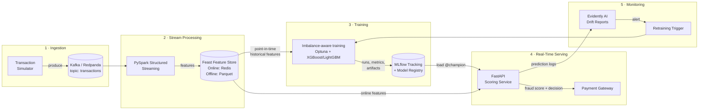

# 🛡️ Real-Time Fraud Detection — Streaming ML & MLOps Pipeline

**An end-to-end, production-style system that scores credit-card transactions for fraud in milliseconds — from live event stream to monitored model in production.**

[](#-project-status--roadmap)
[](https://www.python.org/)
[](https://redpanda.com/)
[](https://spark.apache.org/)
[](https://mlflow.org/)
[](https://fastapi.tiangolo.com/)
[](docker-compose.yml)
[](LICENSE)

> 🎓 **Master's project** — M.Sc. Computer Science, *Data Science & Analytics* track, **EPITA (Paris, France)**.
> 🚧 This repository is built in public, phase by phase. The [roadmap](#-project-status--roadmap) shows live progress, and the [results table](#-results) is filled **only with measured numbers** — never placeholders presented as real results.

---

## ⚡ TL;DR

- **What:** A real-time fraud detection platform: transactions stream through **Kafka/Redpanda**, features are computed live with **PySpark Structured Streaming**, served from a **Feast** feature store, scored by an **XGBoost/LightGBM** model behind a **FastAPI** microservice, and monitored for drift with **Evidently AI**.
- **Why it's hard:** Fraud is **well under 1%** of transactions, patterns change constantly (**concept drift**), and a decision must be made in **< 50 ms** — before the payment clears.
- **How it's solved:** Imbalance-aware training (SMOTE-Tomek / cost-sensitive learning), leakage-free **time-based validation**, **Optuna** tuning on **PR-AUC**, full experiment lineage in **MLflow**, and an automated **monitoring → retraining** loop.
- **How it's built:** Containerised with **Docker Compose**, tested with **pytest**, and shipped through **GitHub Actions** CI — engineered with the rigor of a QA engineer with 5+ years of industry experience.

---

## 💼 What This Project Demonstrates

| Area | What I built | Skills shown |
|---|---|---|
| **Data Science** | EDA, per-card behavioural features, imbalance handling, threshold selection | Statistics, feature engineering, model evaluation under imbalance |
| **Machine Learning** | Gradient-boosted classifiers tuned with Bayesian optimisation | XGBoost, LightGBM, Optuna, scikit-learn, imbalanced-learn |
| **Data Engineering** | Real-time ingestion and windowed stream aggregations | Kafka/Redpanda, PySpark Structured Streaming, Parquet |
| **MLOps** | Feature store, experiment tracking, model registry, drift monitoring | Feast, MLflow, Evidently AI |
| **Software Engineering** | Typed REST API, unit/contract/integration tests, CI/CD | FastAPI, Pydantic, pytest, GitHub Actions, Docker |
| **Product Thinking** | Metrics tied to business cost: fraud losses vs. customer friction | Precision/recall trade-offs, cost-based thresholds |

---

## 🎯 The Problem

Card-not-present fraud costs the global economy tens of billions of dollars every year, and the window to stop a fraudulent payment is measured in **milliseconds**, not hours. Traditional batch-scored models fail here for three reasons:

| Challenge | Why batch models fail | How this system responds |
|---|---|---|
| **Latency** | The transaction has cleared before an overnight job flags it | Pre-computed online features + in-memory model → sub-50 ms scoring |
| **Concept drift** | Fraudsters adapt; a static model decays within days or weeks | Continuous drift monitoring with a retraining trigger |
| **Class imbalance** | With < 1% fraud, a model predicting "never fraud" scores > 99% accuracy — and is useless | Resampling / cost-sensitive learning, evaluated with PR-AUC and recall at fixed false-positive rate |

**Business goal:** catch more fraud, **without** blocking genuine customers — and give the data team full visibility into model health after deployment.

---

## 🏗️ Architecture



**Flow:** `stream → live features → feature store → imbalance-aware training → model registry → real-time scoring → drift monitoring → retraining`

---

## 🧠 Key Engineering Decisions

These are the decisions that separate a production system from a notebook experiment.

**1. Time-based splits, never random shuffling.**
Fraud data is a time series. A random split lets the model "see the future" (e.g. later transactions of the same card), producing inflated scores that collapse in production. Train, validation and test sets are split chronologically.

**2. Resampling is applied to the training fold only.**
SMOTE-Tomek creates synthetic fraud samples. Applying it before splitting would leak synthetic copies into validation/test data. Validation and test sets always keep the real class distribution.

**3. PR-AUC and recall at a fixed false-positive rate — not accuracy.**
Under extreme imbalance, accuracy and even ROC-AUC look deceptively good. PR-AUC focuses on the rare positive class, and *recall @ 1% FPR* answers the real business question: *"How much fraud do we catch while inconveniencing only 1 in 100 legitimate customers?"*

**4. One feature definition for training and serving (Feast).**
The #1 silent failure in production ML is **training/serving skew** — features computed differently offline and online. Feast serves the same feature definitions to both, with **point-in-time correct joins** to prevent label leakage.

**5. Features are pre-computed, not calculated at request time.**
Per-card aggregates (spend and transaction count over the last 1 h / 24 h, velocity, merchant diversity) are computed by the streaming job and stored in Redis. The API only performs a key lookup, which keeps p99 latency low.

**6. Modern MLflow model promotion with aliases.**
Models are promoted with registry **aliases** (`@champion`, `@challenger`) instead of the deprecated stage workflow, which enables clean rollbacks and champion/challenger comparison.

**7. Monitoring without waiting for labels.**
Fraud labels (chargebacks) arrive days or weeks late. The system therefore tracks **data drift** and **prediction drift** as early-warning proxies, and confirms **concept drift** once delayed labels arrive.

**8. Quality engineering from day one.**
Coming from 5+ years in software QA, I treat tests as part of the product: unit tests for feature logic, **contract tests** for the API (including malformed input), a tiny end-to-end training fixture, and CI that blocks merges on failure.

---

## 🗂️ Dataset

**[Credit Card Transactions Fraud Detection Dataset](https://www.kaggle.com/datasets/kartik2112/fraud-detection)** (Kaggle) — simulated card transactions with realistic customer and merchant behaviour.

This dataset was chosen deliberately over the popular PCA-anonymised `creditcard.csv` dataset because it contains **card identifiers, timestamps and merchant categories** — the fields required for real-time, per-card behavioural features.

| Field | Use in this project |
|---|---|
| `cc_num` | Card identifier → entity key for per-card streaming features |
| `trans_date_trans_time`, `unix_time` | Event time → windowed aggregates, time-based splits |
| `amt` | Transaction amount → spend features and drift monitoring |
| `category`, `merchant` | Merchant context → category risk and diversity features |
| `lat/long`, `merch_lat/merch_long` | Location → customer–merchant distance feature |
| `is_fraud` | Target label (strongly imbalanced) |

> Raw data is **not committed** to Git (size limits and good practice). See [`data/README.md`](data/README.md) for download instructions.

---

## 🧰 Tech Stack

| Layer | Tool | Why this choice |
|---|---|---|
| Streaming | **Kafka / Redpanda** | Industry-standard event log; Redpanda is Kafka-compatible and lightweight locally |
| Stream processing | **PySpark Structured Streaming** | Stateful windowed aggregations with event-time semantics |
| Feature store | **Feast** + Redis + Parquet | Online/offline consistency, point-in-time correctness |
| Modelling | **XGBoost / LightGBM** | State of the art for tabular data; native class weighting |
| Tuning | **Optuna** | Efficient Bayesian search with pruning |
| Imbalance | **imbalanced-learn** (SMOTE-Tomek) | Oversampling + boundary cleaning, compared against class weighting |
| Tracking & registry | **MLflow** | Reproducible runs, artifact lineage, alias-based promotion |
| Serving | **FastAPI** + Uvicorn + Pydantic | Async, typed, auto-generated OpenAPI docs |
| Monitoring | **Evidently AI** | Data, target and prediction drift reports |
| Packaging | **Docker / Docker Compose** | One-command reproducible environment |
| CI/CD | **GitHub Actions** | Lint, test and build on every push |
| Testing | **pytest**, Locust | Unit, contract, integration and load testing |

---

## 📊 Results

> Every number below will come from a logged MLflow run or a recorded load test. Cells marked ⏳ have not been measured yet.

| Metric | Target | Result |
|---|---|---|
| PR-AUC (primary metric) | ≥ 0.80 | ⏳ |
| ROC-AUC | ≥ 0.95 | ⏳ |
| Recall @ 1% FPR | ≥ 0.85 | ⏳ |
| p99 inference latency | < 50 ms | ⏳ |
| Throughput per replica | ≥ 500 req/s | ⏳ |
| Drift detection lag | < 24 h from onset | ⏳ |

Planned comparisons: baseline logistic regression vs. XGBoost vs. LightGBM · class weighting vs. SMOTE-Tomek · default vs. business-cost-optimised decision threshold.

---

## 🗺️ Project Status & Roadmap

| Phase | Scope | Status |
|---|---|---|
| 0 | Repository setup, structure, Git workflow | ✅ Done |
| 1 | Data acquisition & exploratory data analysis | ✅ Done |
| 2 | Feature engineering, baseline model, imbalance handling | ✅ Done |
| 3 | Optuna tuning + MLflow tracking & registry | ✅ Done |
| 4 | FastAPI scoring service + API tests | ✅ Done |
| 5 | Docker Compose (Redpanda, MLflow, Redis, API) | 🔄 In progress |
| 6 | Streaming transaction producer | ⏳ Planned |
| 7 | PySpark Structured Streaming features | ⏳ Planned |
| 8 | Feast feature store integration | ⏳ Planned |
| 9 | Evidently drift monitoring + simulated drift | ⏳ Planned |
| 10 | GitHub Actions CI/CD, load testing, final results | ⏳ Planned |
| ★ | Kubernetes deployment (stretch goal) | ⏳ Planned |

---

## 📁 Repository Structure

```
.
├── .github/workflows/         # CI: lint + tests; Docker image build
├── data/
│   ├── raw/                   # Downloaded dataset (git-ignored)
│   ├── processed/             # Engineered features (git-ignored)
│   └── README.md              # How to obtain the data
├── docs/                      # Architecture notes, API docs, drift reports
├── notebooks/
│   ├── 01_eda.ipynb           # Exploratory data analysis
│   ├── 02_feature_engineering.ipynb
│   └── 03_model_experiments.ipynb
├── src/
│   ├── ingestion/             # Kafka/Redpanda producer & consumer
│   ├── streaming/             # PySpark streaming feature jobs
│   ├── feature_store/         # Feast definitions & materialisation
│   ├── training/              # Preprocessing, training, evaluation
│   ├── api/                   # FastAPI app, schemas, model loader
│   └── monitoring/            # Evidently drift reports
├── tests/                     # Unit, contract, integration & load tests
├── Dockerfile
├── docker-compose.yml
├── requirements.txt
└── .env.example
```

---

## 🚀 Quickstart

> Commands describe the target interface; each section becomes runnable as its phase is completed.

### Prerequisites
Python 3.11 · Git · Docker Desktop · Java 17 (for PySpark) · a Kaggle account

### 1. Clone and configure
```bash
git clone https://github.com/Mazadul4x4/Fraud-Detection-Streaming.git
cd Fraud-Detection-Streaming
cp .env.example .env
```

### 2. Option A — everything with Docker Compose
```bash
docker compose up --build
```

| Service | URL |
|---|---|
| Kafka / Redpanda broker | `localhost:9092` |
| Redpanda Console | http://localhost:8080 |
| MLflow UI | http://localhost:5000 |
| Redis (online store) | `localhost:6379` |
| FastAPI (Swagger UI) | http://localhost:8000/docs |

### 2. Option B — local development
```bash
python -m venv .venv
source .venv/bin/activate          # Windows Git Bash: source .venv/Scripts/activate
pip install -r requirements.txt
docker compose up redpanda mlflow redis -d
```

### 3. Get the data
```bash
kaggle datasets download -d kartik2112/fraud-detection -p data/raw --unzip
```

---

## 🔄 Running the Pipeline

```bash
# 1. Stream transactions into Redpanda (replays the dataset as a live stream)
python src/ingestion/producer.py --source data/raw/fraudTest.csv --rate 200

# 2. Compute real-time features with Spark
spark-submit --packages org.apache.spark:spark-sql-kafka-0-10_2.12:3.5.0 \
    src/streaming/spark_features.py

# 3. Register and materialise features
cd src/feature_store/feature_repo && feast apply && cd -
python src/feature_store/materialize.py

# 4. Train, tune and register the model
python src/training/train.py --model xgboost --resampling smote-tomek --n-trials 50

# 5. Serve
uvicorn src.api.main:app --host 0.0.0.0 --port 8000

# 6. Monitor drift
python src/monitoring/drift_report.py \
    --reference data/processed/train.parquet \
    --current data/processed/recent_predictions.parquet \
    --output docs/drift_report.html
```

---

## 📡 API Reference

### `POST /score` — score one transaction

```bash
curl -X POST http://localhost:8000/score \
  -H "Content-Type: application/json" \
  -d '{
        "transaction_id": "txn_123",
        "cc_num": "4263982640269299",
        "amount": 249.99,
        "category": "shopping_net",
        "timestamp": "2020-07-01T23:15:00",
        "customer_dob": "1985-04-12",
        "customer_lat": 40.71,
        "customer_long": -74.0,
        "merchant_lat": 40.9,
        "merchant_long": -73.8,
        "city_pop": 8000000
      }'
```

Response shape:
```json
{
  "transaction_id": "txn_123",
  "fraud_score": 0.0825,
  "decision": "review",
  "threshold": 0.06,
  "model_version": "2",
  "latency_ms": 12.4
}
```
*(Illustrative values. `fraud_score` is a risk score, not a calibrated probability.)*

**Decision rules:** `approve` if score < model threshold (cost-optimal, stored with each model
version in MLflow); `review` (human analyst) up to 0.9; `decline` at 0.9 and above.

**Per-card history** (transaction counts and amounts in the last 1h / 24h, etc.) is kept by the
service between requests and is **unit-tested to match the training features exactly**
(training/serving skew test).

| Endpoint | Purpose |
|---|---|
| `POST /score` | Real-time fraud probability and approve / review / decline decision |
| `GET /health` | Liveness/readiness probe for Docker and Kubernetes |
| `GET /model/info` | Loaded model version, alias and training metadata |

Interactive OpenAPI docs: http://localhost:8000/docs

---

## 📈 Monitoring & Drift Detection

| Drift type | Meaning | Detection |
|---|---|---|
| **Data drift** | Input distributions shift (e.g. holiday spending) | Evidently `DataDriftPreset` on features |
| **Prediction drift** | Score distribution shifts | Evidently on model outputs — early warning before labels arrive |
| **Concept drift** | Fraud patterns change | PR-AUC on delayed labels vs. registered baseline |

A controlled drift event is injected into the stream (`producer.py --inject-drift`) to **measure** how fast the system detects it. Retraining is triggered when PR-AUC on recent labelled data drops more than ~5% relative to the baseline.

---

## ✅ Testing

```bash
pytest tests/ -v                                 # full suite
pytest tests/ --cov=src --cov-report=term-missing # with coverage
pytest tests/ -m "not integration and not load"  # fast unit tests only
```

| Test file | Covers |
|---|---|
| `test_ingestion.py` | Event serialisation, producer behaviour (mocked broker) |
| `test_features.py` | Correctness of windowed feature logic on small fixtures |
| `test_training.py` | No leakage across splits, resampling on train only, end-to-end run on a tiny dataset |
| `test_api.py` | API contract, validation errors, malformed input |
| `load_test.py` | Latency and throughput benchmarks (run manually) |

---

## ⚙️ CI/CD

- **`ci.yml`** — on every push and pull request: install dependencies → `ruff` lint → `pytest` with coverage.
- **`docker-build.yml`** — on merge to `main`: build the API image, tagged with the commit SHA.

---

## ☁️ Deployment Path (Cloud / Kubernetes)

| Local component | Production equivalent |
|---|---|
| Redpanda container | Amazon MSK / Confluent Cloud / Redpanda Cloud |
| Redis container | ElastiCache / Memorystore |
| Local Parquet | S3 / GCS / BigQuery |
| MLflow container | MLflow with managed Postgres + object storage |
| Docker Compose | Kubernetes (EKS/GKE): Deployment + HPA + Ingress + CronJobs for drift checks |

Secrets are managed with Kubernetes Secrets or a cloud secret manager — never committed to Git.

---

## 🔭 Future Work

- **SHAP explanations** in the `/score` response for fraud-analyst review
- **Shadow deployment** of challenger models before promotion
- **Fully automated retraining** triggered by drift alerts
- **Graph features** to detect fraud rings (shared devices, merchants, locations)

---

## 👤 About the Author

**Md Mazadul Islam** — Software QA Engineer (5+ years) transitioning into **Data Science & ML Engineering**, currently completing an **M.Sc. in Computer Science (Data Science & Analytics) at EPITA, Paris**.

My QA background shapes how I build ML systems: reproducible environments, tests for data and models (not just code), and monitoring after release — because a model that works in a notebook but fails silently in production is a defect.

- 🌐 Portfolio: [mazadul4x4.com](https://mazadul4x4.com)
- 💼 LinkedIn: [your LinkedIn profile](https://www.linkedin.com/in/mazadulofficial/)
- 🐙 GitHub: [@Mazadul4x4](https://github.com/Mazadul4x4)

*Open to Data Scientist, ML Engineer and MLOps opportunities in France and Europe.*

---

## 📄 License

Released under the [MIT License](LICENSE).
